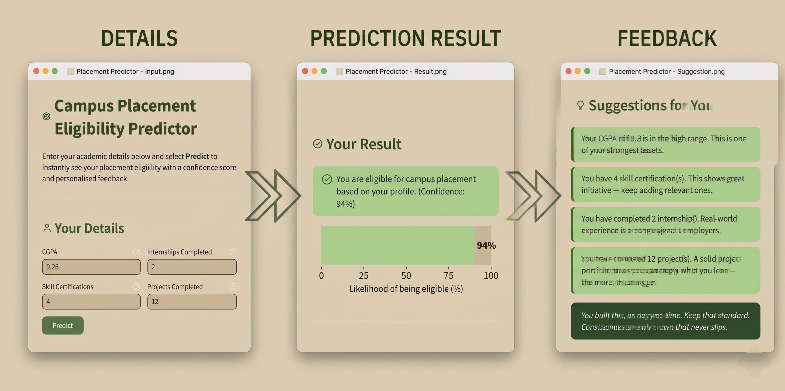

# Campus Placement Eligibility Predictor

> *Part of my self-learning journey into Machine Learning and real-world app development.*

---

## What This Project Does

Predicts whether a student is eligible for campus placement based on four inputs - CGPA, skill certifications, internships, and projects - using a trained Machine Learning model with an interactive web app.

---

## Application Preview

<p align="center">
  
</p>

---

## Tech Stack

- Python, Pandas, NumPy
- Scikit-learn — model training & evaluation
- Matplotlib, Seaborn — visualizations
- Jupyter Notebook — exploratory analysis
- Streamlit — web app

---

## Project Structure

```
.
├── data.csv          # Dataset
├── features.py       # Feature engineering (shared by training + app)
├── eda.py            # EDA script — generates plots
├── eda.ipynb         # EDA notebook (interactive)
├── train_model.py    # Preprocessing, training, evaluation
├── app.py            # Streamlit web app
└── requirements.txt
```

---

## How It Works

**1. Data Preprocessing**
Duplicate removal, missing value handling, and feature scaling with `StandardScaler`.

**2. Exploratory Data Analysis**
Run `python eda.py` or open `eda.ipynb` to explore class balance, feature distributions, correlation heatmap, eligibility rates, and pairwise relationships.

**3. Feature Engineering** — in `features.py`
- `experience_score` = skills + internships + projects
- `cgpa_band` = Low / Medium / High bucket
- `cgpa_experience_interaction` = cgpa × experience_score

**4. Model Training & Evaluation** — `train_model.py`
Trains a Random Forest Classifier and evaluates it with accuracy, precision, recall, F1-score, ROC-AUC, confusion matrix, and a classification report.

**5. Web App** — `app.py`
Enter your details and instantly get a placement prediction, confidence score, a visual likelihood bar, and personalised suggestions on where to improve.

---

## Run Locally

```bash
pip install -r requirements.txt
python train_model.py
streamlit run app.py
```

To explore the data first:
```bash
python eda.py
# or open eda.ipynb in Jupyter
```

---

📧 **Email** — [jayavarshinijayakumaran11@gmail.com](mailto:jayavarshinijayakumaran11@gmail.com)

🙌 **Connect** — [LinkedIn: Jayavarshini Jayakumaran](https://www.linkedin.com/in/jayavarshini-jayakumaran)

📄 **License** — [MIT](LICENSE)

<p align="center"><b>Finish what you started 💻</b></p>